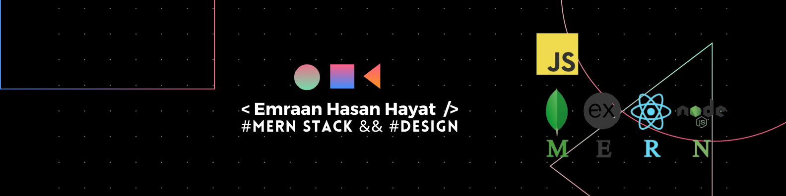

---

<h1 align="center">Hi 👋, I'm Hayat ~</h1>
<h3 align="center">A passionate MERN Stack developer from Bangladesh</h3>

  

- 🔭We've done recently a project [Dwelling](https://github.com/HayatEmraan/dwelling)

- 🌱 I'm currently learning **Prisma**

- 👨‍💻 All of my projects are available at [https://emraan.me/works](https://emraan.me/works)

- 💬 Ask me about **React, Next, MongoDB, Express**

## 🌐 Socials:

## 💻 Languages and Tools:

                            

## 😂 Random Dev Meme

## ✍️ Random Dev Quote:

